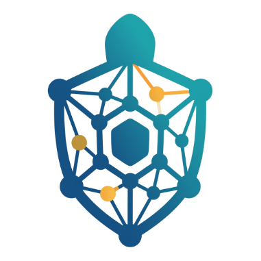

<div align="center">

<p></p>

# DeepTurtol

### An agent-native learning and knowledge workspace

Build a durable learning environment around your conversations, documents,
tools, and long-running goals. DeepTurtol combines an adaptable tutor with a
multi-engine knowledge base, so the chat model can reason over evidence you
control instead of treating every session as a fresh start.

[Get started](#run-locally) · [Knowledge bases](#knowledge-bases) · [Architecture](#architecture) · [Contributing](CONTRIBUTING.md)

</div>

## What DeepTurtol is for

DeepTurtol is not a generic chat wrapper. It is a workspace for learning,
research, and building understanding over time.

- **One agentic runtime** for chat, deep solve, research, question generation,
  guided learning, visualization, and math animation.
- **Knowledge you can inspect and evolve**: versioned document indexes,
  incremental uploads, citations, linked libraries, and parser provenance.
- **Bring your own models**: OpenAI-compatible endpoints, local models, and
  provider profiles are configured at runtime rather than hard-coded into the
  project.
- **Tools, skills, and partners**: extend a turn with search, code execution,
  MCP tools, personal skills, or long-running companion agents.
- **Local-first control**: your settings, memory, workspaces, and knowledge
  bases live under `data/user/` rather than in a project `.env` file.

## Knowledge bases

The knowledge system is designed around a simple rule: parsing is separate from
retrieval. DeepTurtol first converts a document into a common representation,
then the selected engine indexes that representation.

| Engine | Best fit |
| --- | --- |
| **LlamaIndex** | General-purpose local hybrid vector/BM25 retrieval. |
| **LazyGraphRAG** | Fast local incremental updates with a query-scoped graph; ideal when the chat LLM writes the final answer. |
| **LightRAG / RAG-Anything** | Opt-in persistent graph retrieval for relationship-heavy material; LLM-intensive during indexing. |
| **GraphRAG** | Microsoft GraphRAG workflows for larger graph-oriented corpora. |
| **PageIndex / Tencent IMA / LightRAG Server** | Connected or hosted knowledge systems managed outside the local index. |
| **KAG (OpenSPG)** | Ontology-oriented graph retrieval for structured knowledge projects. |

Document parsing is configurable in Settings. Docling is a strong default for
digital PDFs and Office files; MinerU is useful for complex scans, formulas, and
layout-heavy PDFs; lightweight paths handle text and images. The next evolution
is policy-based parser routing: select the right parser per file, retain its
quality signals and provenance, and use an LLM only for genuinely ambiguous
cases.

Read the LazyGraphRAG guide in [DOCS/LAZY_GRAPHRAG.md](DOCS/LAZY_GRAPHRAG.md).

## Run locally

Requirements: **Python 3.11–3.13** and **Node.js 22 LTS**.

```bash
git clone https://github.com/PcRoGamer/DeepTurtol.git
cd DeepTurtol

python -m venv .venv
# macOS/Linux
source .venv/bin/activate
# Windows PowerShell: .\.venv\Scripts\Activate.ps1

python -m pip install --upgrade pip
python -m pip install -e .
(cd web && npm ci --legacy-peer-deps)

deeptutor init
deeptutor start
```

Open [http://127.0.0.1:3782](http://127.0.0.1:3782), then configure a model and
document parser in Settings. Runtime data is created under `data/user/`.

### Useful commands

```bash
# Ask from the command line
deeptutor run chat "Explain the Fourier transform intuitively"

# Create or inspect a knowledge base
deeptutor kb list
deeptutor kb create course-notes --doc lecture-01.pdf

# Run a capability with knowledge retrieval enabled
deeptutor run deep_solve "Compare these two methods" --tool rag --kb course-notes

# Start the Web/API application
deeptutor start
```

### Optional extras

```bash
pip install -e ".[dev]"             # test and lint tooling
pip install -e ".[partners]"        # partner channels and MCP client
pip install -e ".[math-animator]"   # Manim-powered visualizations
pip install -e ".[matrix-e2e]"      # Matrix E2EE support
```

## Architecture

```text
CLI / WebSocket API / Python SDK
              │
              ▼
      ChatOrchestrator
              │
      ┌───────┴────────┐
      ▼                ▼
  Tools            Capabilities
  (one action)     (multi-stage turn)
      │                │
      └────────┬───────┘
               ▼
          StreamBus
               │
     Chat, UI, API consumers
```

Capabilities own multi-stage workflows such as deep research, deep solve,
guided learning, visualization, and math animation. Tools are small,
context-gated actions available to the chat loop: retrieval, web and paper
search, memory, source reading, skills, notebooks, code execution, and more.

The implementation landmarks:

| Path | Role |
| --- | --- |
| `deeptutor/runtime/orchestrator.py` | Unified turn routing. |
| `deeptutor/capabilities/` | Multi-stage learning workflows. |
| `deeptutor/tools/` | Chat-callable tools. |
| `deeptutor/services/rag/` | Knowledge-base providers and versioned storage. |
| `deeptutor/services/parsing/` | Shared parser bridge and canonical parsed-document IR. |
| `deeptutor/services/config/` | Runtime settings and model/provider profiles. |
| `web/` | Next.js workspace UI. |

## Project direction

DeepTurtol is developing its own product direction around:

1. A learning companion that can teach, investigate, and create—not only chat.
2. A trustworthy knowledge layer with transparent evidence and parser
   provenance.
3. Fast, practical local retrieval as the default, with graph and hosted
   engines available when their trade-offs are justified.
4. User-owned configuration, skills, memory, and long-lived learning context.

## Contributing

Issues and pull requests are welcome. Please keep changes focused, add tests
for behavior changes, and avoid committing runtime data, downloaded models, or
local secrets. See [CONTRIBUTING.md](CONTRIBUTING.md) for repository guidance.

## Provenance and license

DeepTurtol began from the Apache-2.0 licensed DeepTutor codebase. We retain the
applicable attribution and license obligations while maintaining an independent
roadmap, product identity, retrieval system, and user experience.

Licensed under [Apache-2.0](LICENSE).
