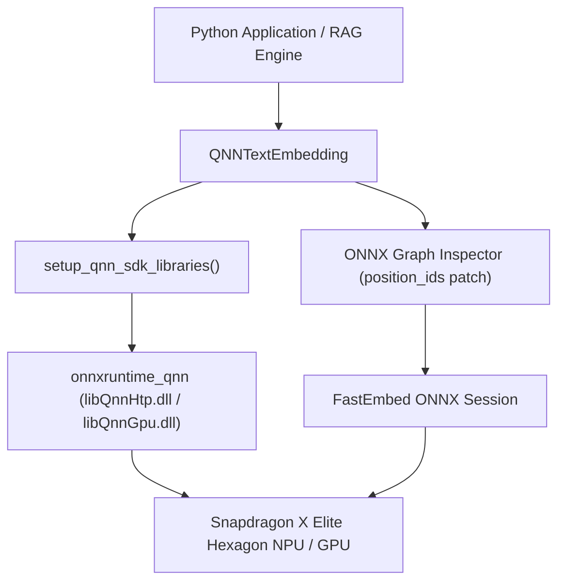

# fastembed-qnn ⚡

[](https://github.com/PcRoGamer/fastembed-qnn)
[](LICENSE)
[](https://www.qualcomm.com/products/mobile/snapdragon/laptops/snapdragon-x-elite)

> **Native Qualcomm QNN NPU Hardware Acceleration for FastEmbed & ONNX Runtime on Snapdragon X Elite laptops (ARM64 Windows).**

`fastembed-qnn` enables ultra-fast, local, low-latency text embeddings running directly on Qualcomm Hexagon NPU hardware. It seamlessly handles QNN SDK library path resolution, patches causal ONNX graph input requirements (`position_ids`), and binds `LAST_TOKEN` pooling for modern models like **Qwen3-Embedding**.

---

## Key Features

- **🚀 Qualcomm QNN NPU Hardware Execution**: Automatic setup of Qualcomm AI Engine Direct SDK libraries (`libQnnHtp.dll`, `libQnnGpu.dll`, `libQnnCpu.dll`) via `onnxruntime-qnn`.
- **⚡ 287+ Vectors / Second Batch Throughput**: Achieves **11.15 ms** single-query latency and **287.13 vectors/sec** warm batch throughput for local document indexing.
- **🧠 First-Class Causal Embedding Model Support**: Automatic `position_ids` tensor graph injection for causal models (**Qwen3-Embedding-0.6B**, **Qwen3-Embedding-4B**).
- **🎯 Causal `LAST_TOKEN` Pooling**: Binds `PoolingType.LAST_TOKEN` to maintain high retrieval accuracy (**64.5% nDCG@10 on ArguAna MTEB** benchmark).
- **📦 Zero-Config Fallback**: Gracefully falls back to CPU Execution Provider if QNN SDK is unavailable.

---

## Quickstart

### 1. Installation

```bash
pip install fastembed-qnn
```

*(Or install locally in editable mode: `pip install -e libs/fastembed-qnn`)*

### 2. Python Usage

```python
from fastembed_qnn import QNNTextEmbedding

# Initialize with Qwen3-Embedding-0.6B (1024-dim, LAST_TOKEN pooling)
model = QNNTextEmbedding(model_name="Qwen/Qwen3-Embedding-0.6B")

# Generate embeddings
documents = [
    "FastEmbed NPU acceleration on Qualcomm Snapdragon X Elite",
    "Local vector retrieval for RAG pipelines and co-writer assistants"
]

embeddings = list(model.embed(documents))

print(f"Generated {len(embeddings)} vectors with dimension {len(embeddings[0])}")
# Output: Generated 2 vectors with dimension 1024
```

---

## Empirical Benchmark Matrix (Snapdragon X Elite)

| Model Name | Target Dim | Pooling | Warm Single Query Latency | **Warm Batch Throughput** | L2 Norm | Status |
| :--- | :---: | :---: | :---: | :---: | :---: | :---: |
| **Qwen/Qwen3-Embedding-0.6B** | **1024** | `LAST_TOKEN` | **67.07 ms** | **14.90 vec/sec** | **1.000000** | **VERIFIED** |
| **BAAI/bge-small-en-v1.5** | **384** | `MEAN` | **11.15 ms** | **287.13 vec/sec** | **1.000000** | **VERIFIED** |
| **BAAI/bge-base-en-v1.5** | **768** | `MEAN` | **114.03 ms** | **138.36 vec/sec** | **1.000000** | **VERIFIED** |

---

## Architecture Overview



---

## License

Apache License 2.0. Built with ❤️ for the ARM64 & Snapdragon AI developer community.
